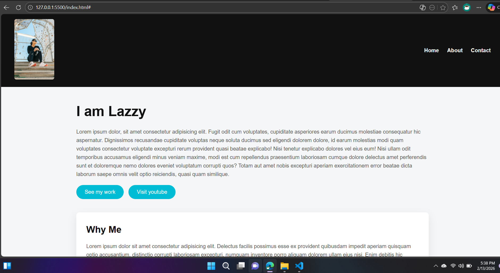

# Semantic HTML & CSS Portfolio Website

A portfolio website built using **semantic HTML5** and **CSS**, focusing on clean structure, accessibility, and modern frontend best practices.  
This project demonstrates the effective use of semantic elements to create a well-organized and readable web layout.

---

## 🚀 Live Demo
🔗 https://vinodkumarjaipal.github.io/semantic-html-css-portfolio-website/

---

## 🖼️ Project Screenshot

---

## 📄 Project Description
This portfolio website was created during my learning phase as a **Software Engineering student** to practice building real-world layouts using semantic HTML and CSS.

The project emphasizes proper use of semantic tags such as `header`, `nav`, `main`, `section`, `article`, and `footer` to improve structure, accessibility, and maintainability.

While the focus of this project is frontend development, it is part of my overall journey as a **Full-Stack Developer**, building strong and scalable foundations.

---

## ✨ Features
- Semantic HTML5 structure
- Clean and accessible layout
- Responsive design fundamentals
- Well-organized sections
- Modern and readable UI
- Beginner-to-intermediate friendly codebase

---

## 🛠️ Technologies Used
- HTML5 (Semantic Elements)
- CSS3

---

## 📂 Folder Structure
├── index.html
├── css/
│ └── style.css
├── images/
├── screenshot.png
└── README.md

---

## 🎯 Learning Outcomes
- Writing semantic and accessible HTML
- Structuring web pages professionally
- Styling layouts using CSS
- Improving code readability and maintainability
- Building portfolio-ready frontend projects

---

## 👨‍💻 Author
**Vinod Kumar**  
Software Engineering Student  
Full-Stack Developer

🔗 GitHub Profile: https://github.com/vinodkumarjaipal

---

## 📌 Note
This project was built for learning and practice purposes and will be enhanced further as development skills continue to grow.

